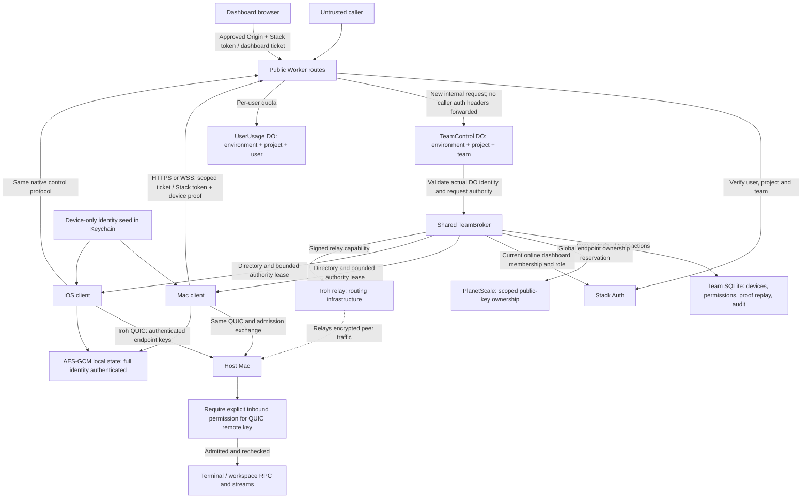

# Mac and iOS Iroh security audit

Follow-up to #12105 and #13458, prepared for Aziz's review in #13881.
This is an audit of the client and Worker source, with focused regression evidence.
It is not a production penetration test or a completed device-security sign-off.

## Required boundary

An endpoint ID is an Ed25519 **public key**, not an access token. The Worker,
authorized peers and transport infrastructure necessarily handle it. Knowing
that ID must not grant terminal access or permit impersonation. The corresponding
32-byte private seed must stay in the owning app's private storage and must never
be included in requests, diagnostics or telemetry.

The target is the same security mechanism on Mac and iOS: authenticated discovery,
proof of private-key possession, encrypted transport, explicit host admission,
bounded permissions, and protected persistence. Identical mechanisms do not mean
silently broadening Mac access to every account allowed by the iOS product policy.

## Trust-boundary map

The control plane is trusted to authorize peers; its compromise is not prevented
by endpoint-key secrecy. The relay is not a terminal authorization authority.
Its transport coordinates and credential are distinct from peer admission.

| Entry point | Required authority and containment |
| --- | --- |
| `POST /v2/control/session`, `GET /v2/control/socket` | Native Stack bearer or environment/project-bound API ticket. Enrolled identities also prove possession of the exact endpoint key, with signed setup and replay protection. |
| `POST /v2/requests` and aliases `/v2/tickets`, `/v2/challenges`, `/v2/devices/register`, `/v2/relay/token` | Same public authentication and full-tuple check, plus signed HTTP setup/request and matching request ID. Aliases cannot select a different operation schema. |
| `POST /v2/dashboard/session` | Approved browser Origin and Stack identity/team verification; dashboard tickets are a separate token kind. |
| `GET /v2/dashboard/socket` | Origin-bound dashboard ticket in WebSocket subprotocol; no native endpoint identity and no use as a native API ticket. Online membership/management checks are being hardened here. |
| TeamControl internal `/session`, `/socket`, `/request`, `/dashboard/socket` | Worker bindings only. Internal origin, header/schema and actual DO ID checks enforce environment/project/team scope. Forged caller headers are not forwarded. |
| UserUsage internal RPC | Scope-bound user DO; shared operation quotas and connection/output reservations across teams. No public Worker route exposes the binding. |
| `mobile.host.status` | Identity-free response for unauthenticated callers; private routes require verified ownership or already-admitted context. |
| Direct or relayed Iroh connection | QUIC authenticates the endpoint key, then `V2InboundAdmissionAuthority` requires a current inbound permission. Knowing an ID or seeing a device in discovery grants nothing. |

| Broker operation | Additional gate |
| --- | --- |
| `challenge.request.v1`, `device.register.v1` | Exact session descriptor; bounded one-time challenge, signed payload, ownership reservation, immutable endpoint binding and revocation checks. |
| `ticket.request.v1` | Fresh Stack verification and registered, unrevoked device rechecked after external calls. |
| `relay.request.v1` | Registered, unrevoked device; configured relay set; short-lived signed capability. |
| `directory.request.v1` | Enrolled native device or online dashboard authority; owner/granted visibility, separate inbound permission, consistent revision/pagination and bounded response. |
| `device.metadata.v1` | Own registered device only; cannot switch its platform through metadata. |
| `device.revoke.v1` | Owner or explicit management grant; dashboard management authority is checked online. |
| `permission.update.v1` | Device management authority, target team membership, and rechecks after asynchronous verification. |
| `preferences.update.v1` | Current team management authority, configured relay allowlist, expected revision. |
| `session.goodbye.v1`, `session.ack.v1` | Own connection/session; acknowledgement must match the server-issued delivery ledger. No device/permission mutation authority. |

Native tickets deliberately bound offline authority to the latest Stack
verification plus one hour. Reusing an HMAC ticket does not refresh that timestamp.
Known device/permission revocations propagate through directory revisions; team
membership changes still have the documented bounded stale-authority window.
That is a product security policy requiring sign-off, not proof of immediate
global revocation while devices are offline.

## Source audit

| Boundary | Mac and iOS evidence | Assessment |
| --- | --- | --- |
| Identity | Both use [`V2IdentityKeyStore`](../../Packages/Shared/CmuxIrxTransport/Sources/CmuxIrxTransport/V2/V2IdentityKeyStore.swift), scoped by environment, project, team, user, installation, namespace and build tag. The stored bytes are the private seed; the public ID is derived by [`V2IdentityKey`](../../Packages/Shared/CmuxIrxTransport/Sources/CmuxIrxTransport/V2/V2IdentityKey.swift). | Both production paths now use the shared Data Protection Keychain adapter with explicit non-sync and `AfterFirstUnlockThisDeviceOnly`. Signed-device migration remains a verification gate. |
| Enrollment and directory | [`routing.ts`](../../workers/iroh-v2/src/routing.ts) authenticates before team dispatch. [`broker.ts`](../../workers/iroh-v2/src/broker.ts) verifies device signatures; [`team-store.ts`](../../workers/iroh-v2/src/storage/team-store.ts) computes visible devices and inbound permissions separately. | The directory is not an unauthenticated lookup by endpoint ID. Authorized owners, granted users and dashboard team managers can receive permitted device information. |
| Public Mac status | [`MobileHostService`](../../Sources/Mobile/MobileHostService.swift) returns identity-free status without verified Stack ownership. Route disclosure suppresses all attach routes for `publicStatus`. | Public status must not reveal the Iroh ID. A focused disclosure test covers the shared policy. |
| Outgoing transport | [`DeviceIrxClient`](../../Sources/Devices/DeviceIrxClient.swift) and [`MobileIrxRuntimeComposition+Dial`](../../ios/cmuxPackage/Sources/cmuxFeature/MobileIrxRuntimeComposition+Dial.swift) use `IrxEndpointSupervisor`, `IrxAdmission.performClient` and `IrxClientSession`. | Same Iroh encrypted transport and admission exchange. The Mac client additionally checks exact account, namespace, tag and host opt-in through `IrxMacPeerAuthorization`. |
| Host admission | Both modern peer types enter [`V2InboundAdmissionAuthority`](../../Packages/Shared/CmuxIrxTransport/Sources/CmuxIrxTransport/V2/V2InboundAdmissionAuthority.swift), keyed by the QUIC-authenticated remote key. Outbound visibility is not permission to enter. | New parameterized coverage proves that a known, visible Mac or iOS endpoint is denied without inbound permission, admitted with it, and denied after removal. Existing tests cover scope, expiry and revocation. |
| Persistence | Both compositions use [`V2FileStateStore`](../../Packages/Shared/CmuxIrxTransport/Sources/CmuxIrxTransport/V2/V2FileStateStore.swift). | Confirmed plaintext exposure; hardened here with the same encryption and migration on both platforms. |
| Diagnostics | Both use [`IrxJournal`](../../Packages/Shared/CmuxIrxTransport/Sources/CmuxIrxTransport/IrxJournal.swift). The endpoint bind event previously recorded the complete ID at public log privacy. | Confirmed full-ID exposure; hardened here before retention and output, including IDs embedded in attribute error messages. |

## Changes in this PR

- Revalidate current team membership and management rights for online dashboard
  operations instead of trusting the role in an old ticket. Recheck expiry after
  network lookups. A removed member's next operation is denied and its socket closes
  with code 1008. Native Mac/iOS offline leases are unchanged.
- Keep the latest **65,536 authority audit events**. Prune the oldest rows and append
  the new event inside the same mutation transaction, preserving rollback on failure.
  A full audit history no longer blocks revocation. This deliberately trades old
  forensic history for bounded storage and continued security mutations; the audit
  table is not an indefinite historical archive.
- Use a shared production Keychain implementation for endpoint seeds and installation
  IDs on both platforms. Mac file-keychain values migrate only within the exact
  service/account, retaining their bytes and requiring successful primary readback
  before deleting the old item. Conflicting or locked stores fail closed, including
  after restart. iOS never probes or deletes a separate legacy keychain domain.
- Encrypt v2 state with AES-GCM. HKDF-SHA256 derives a separate cache key from
  the existing endpoint seed with a versioned, cache-specific purpose. The complete
  identity is authenticated associated data. No new endpoint or Keychain identity
  is generated by this change.
- Both compositions supply their already-loaded identity key to the same store.
  Encrypted files remain owner-readable and the state directory is excluded from
  backup. Keychain failure cannot select an unencrypted persistence implementation.
- Upgrade a matching old v2 JSON cache to `.sealed`, verify the written state, then
  remove that scope's plaintext file. A failed write preserves the old copy. An
  existing encrypted file never falls back to older plaintext after decryption
  failure. Invalid ciphertext yields no cached authority; signed setup can recover.
- Redact full 64-hex endpoint IDs from journal attributes before the in-memory ring,
  system log and JSONL output. Peer transport and native admission policy are unchanged.
- Enforce owner-only permissions and backup exclusion for iOS user-pinned local
  addresses, including existing files on read.

## Dependency and secret scans

The Worker dependency audit found development-only `esbuild` advisory
[GHSA-67mh-4wv8-2f99](https://github.com/advisories/GHSA-67mh-4wv8-2f99) through
Drizzle's TypeScript loader. Pinning the transitive copy to `0.28.1` matches the
version already used by Wrangler. `bun audit` then reports no advisories; the
Drizzle loader transform, Worker check and workerd tests pass.

The pinned Iroh FFI release is `1.0.2-cmux.7.ios17.3`, source
`af08f0e1b9bb3ddb839210b175738d5761fea686`. Querying its 483 registry lockfile
entries against OSV identified three patchable advisories:

| Package | Fix in [iroh-ffi #16](https://github.com/manaflow-ai/iroh-ffi/pull/16) | Reachability qualification |
| --- | --- | --- |
| `h2` 0.4.15 | 0.4.16; RUSTSEC-2026-0258 | Unbounded empty HTTP/2 DATA frames. Requires an active HTTP/2 stream; default cmux exploitation was not established. The relay data transport uses WebSocket, not this path. |
| `lru` 0.18.0 | 0.18.2; RUSTSEC-2026-0253 | Requires `pop`, a panicking key destructor and caught unwinding. The pinned consumer uses `get_key_value`/`put` with a `Copy` public key; those trigger conditions were not found. |
| `rustls` 0.23.40 | 0.23.45, plus required `rustls-webpki` 0.103.15; RUSTSEC-2026-0285 | Wrong TLS 1.3 encryption-level boundaries can be accepted. The handshake transcript remains authenticated; this does not establish endpoint impersonation. |

The dependency patch passed 28 Rust library tests on the fork's main line and
31 tests when applied to cmux's exact pinned release source. After the patch,
OSV reports only the existing informational unmaintained notices for
`atomic-polyfill` and `paste`. Git dependencies and the published binary's
contents are outside that registry scan.

The cmux binary now consumes the newly published XCFramework at that pin. Its
archive checksum is `f1605640a02925dd0941c15765162fac872c449e5e56d39c035ee163d409527e`.
The update uses a new release artifact; no existing release artifact was overwritten.

Gitleaks scanned 771 tracked source/config/test files across the Worker and both
transport/client implementations. All 13 matches were inspected: ten were
CryptoKit private-key type declarations, two were PEM strings assembled from
fresh keys generated inside tests, and one was the deliberately invalid deploy
probe token. No embedded production secret was identified in that bounded scan;
developer private env files and real Keychain contents were not read.

## Review gates and remaining limits

- **macOS Keychain migration:** the previous v2 queries used the file keychain.
  This PR adds the migration above; fake-store tests establish its state transitions,
  not real signing/ACL/access-group behavior. Verify upgrades and locked/background
  access on signed Mac/iOS builds. A downgrade to a Mac binary that knows only the
  old file keychain is not validated after its legacy item has been removed.
- **Development keys:** `MobileHostV2Installation` uses owner-only files in Debug;
  `MobileIrohV2InstallationStore` uses files on Simulator but Keychain on physical
  iOS devices. Encrypted caches do not protect against a process that can read those
  development seeds. Decide whether signed Mac Debug builds should also use Keychain.
- **Ongoing legacy metadata:** the Mac still constructs
  `legacy-compat/<endpointID>`, and the legacy cache scope puts the ID in Keychain
  account metadata. These are current local exposures, not only historical files.
  Old journals, backups and inactive scopes can also retain IDs. This PR does not
  claim complete local ID secrecy or erase those artifacts. Hashing those legacy
  scope components requires preserving the existing cache/Keychain account mapping.
- **Legacy peers:** the host retains a separate legacy protocol/authorization path
  for older iOS clients. Modern endpoints are excluded from legacy fallback. This
  audit does not establish complete security of every legacy RPC or terminal lane.
- **Threat model:** authorized recipients can retain a public ID. Encryption does
  not defend against control of the running app, access to its private key, or replay
  of an old authentic encrypted snapshot within its permission lifetime. Plaintext
  migration preserves the previous trust model; it does not retrospectively prove
  that old local bytes were never modified.
- **Device verification:** test an upgrade with the existing identity, relaunch,
  background/locked-device access, sign-out/revocation, and Mac-to-Mac plus iOS-to-Mac
  reconnection on signed devices. No physical-device Keychain or end-to-end security
  verification has been completed for this PR.
- **Production Worker:** the missing Mac permission tracked in #13458 remains a
  separate deployment concern. These client changes neither deploy nor certify the
  production Worker revision.

## Validation

- The test-only revision `0f50a2681f` failed for plaintext cache contents and full
  endpoint IDs in the journal in [hosted CI](https://github.com/manaflow-ai/cmux/actions/runs/35816037875/job/107037703790).
- After the fix, 40 focused Swift tests pass: encrypted persistence for both platform
  descriptors, restore with the same seed, plaintext migration, failed-write
  preservation, wrong-key/tamper/scope rejection, no plaintext fallback, journal
  redaction, inbound admission, Mac authorization, WebSocket behavior and 13 Keychain
  migration/error/restart cases.
- Worker unit checks pass 49 tests; real workerd tests pass 28, including dashboard
  membership-loss socket closure and exact audit-cap revocation/rollback. The DO
  regressions also failed on test-only commit `05900784f0` before the fix.
- Public-status route disclosure passes its focused test. The unchanged iOS local-path
  source and its checked-in test pass in an isolated macOS Swift package harness;
  this does not establish full iOS app compilation or device execution.
- No product UI copy changed. The localization audit covers this contributor audit
  and invariant diagnostic output; no translated UI keys are introduced.
