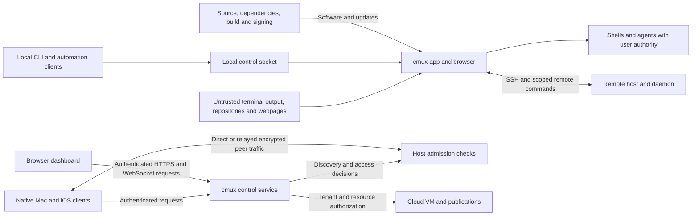

# cmux threat model outline

Reviewed against source revision `ccefb63aa84` on 2026-10-06. This is a starting
map for security review, not a penetration-test report or a claim that every
control has been verified in production. [SECURITY.md](../../SECURITY.md)
defines vulnerability reporting and supported versions.

## Scope and assumptions

The scope is the macOS terminal and embedded browser, CLI and local automation,
SSH and remote daemons, iOS access to Macs, cmux Cloud and its dashboard,
published previews, and build/update distribution. TUI clients and alternate
transports share these review goals but need their own implementation evidence.
Unreleased architectures and historical audits do not establish guarantees for
the version a user has installed.

cmux runs shells and agents with the authority available to those processes.
The desktop app is not a sandbox for untrusted commands, repositories, shell
configuration, or agents. Approving an agent or giving it terminal/automation
access delegates real authority; workspace and pane separation are not OS
security isolation. A fully compromised user account, running app, or operating
system can defeat protections that depend on that host. This limitation does
not excuse cross-user, remote-to-local, or tenant-boundary violations.

## Assets and adversaries

Protect shell execution authority; source files, terminal contents and session
state; account tokens and device private keys; browser sessions and clipboard
data; team membership and VM access; service availability; and the integrity of
distributed software and updates.

Consider an unauthenticated network caller, a malicious or former team member,
a hostile remote host, a compromised paired device, a local process or different
OS user, malicious web or terminal content, a crafted repository, and a
compromised dependency, build account, or service operator. Treat model output,
webpages, filenames, and terminal escape sequences as untrusted input even when
they arrive through an authenticated connection.

## Trust boundaries and data flow

Each arrow crossing a process, host, account, tenant, or service boundary needs
its own validation. Discovering a device or knowing an object ID is not
authorization. Transport encryption protects a connection; it does not decide
which commands or resources the peer may use. The control service is trusted
to make access decisions: encrypted peer traffic does not remove that trust.
Relay infrastructure can observe connection metadata and affect availability
even when it cannot read encrypted peer payloads.

## Threats and review requirements

The protections below are requirements to check, not blanket assertions that
every path already enforces them. The source map identifies existing controls
and places to collect evidence.

| Boundary | Threat and impact | Required protection and verification |
| --- | --- | --- |
| Terminal or repository content to execution | Escape sequences, pasted text, metadata or configuration become unintended commands; hostile output spoofs trusted UI. | Keep data separate from commands; inspect quoting, paste and URL handling, configuration execution, and renderer parsing. Test hostile inputs and user-consent boundaries. |
| Local client to automation socket | Another process reads terminals or controls shells beyond the configured access. | Enforce the selected socket mode, file permissions and connection authorization, including mode changes and reconnects. Automation access is powerful; test denied callers as well as intended clients. |
| Remote host to local app | An authenticated remote caller invokes local commands or accesses another workspace. | Deny unlisted relay methods, reject command-bearing parameters, and scope object IDs to the remote session. Test aliases, new parameters and lifecycle transitions. |
| Device discovery to host admission | Stolen/replayed credentials, stale permissions or a revoked peer gain terminal access. | Bind identity proof and authorization to their intended scope; recheck admission and revocation, including offline caches and legacy paths. Possession of a public endpoint ID alone must grant no access. |
| Account/team to Cloud resource | A caller changes an ID or reuses stale membership to reach another tenant's VM, files or terminal. | Authorize the actor and target server-side for each operation; test cross-user/team requests, deletion, revocation, caches and reconnects. |
| Browser or preview to privileged service | Script injection, forged requests, unsafe redirects, proxy abuse or exposed previews leak credentials or bridge into local/network authority. | Enforce origin and session boundaries, explicit publication access, scoped capabilities, safe redirects and destination validation. Test unauthenticated and wrong-team access. |
| Secrets and private state to storage or diagnostics | Tokens, keys, terminal contents or personal data escape through logs, caches, backups or uploaded evidence. | Minimize collection, protect secrets in platform storage, redact before upload, and test sign-out, migration, restore and deletion paths. Do not assume all application data is encrypted. |
| Network/content to resource usage | Connection, output or parsing floods exhaust client/service resources or grow bills. | Bound input, queues, connections and retries; enforce quotas at the authority that owns the resource and test cancellation and cleanup. |
| Source/build to user installation | A dependency, workflow, signing key or update feed distributes attacker code. | Restrict publishing authority, separate untrusted build inputs from secrets, and verify artifact provenance, signing and update validation. Test recovery and key replacement separately from successful release builds. |

## Existing source and review anchors

- [Socket modes and permissions](../../Packages/macOS/CmuxSettings/Sources/CmuxSettings/Values/SocketControlMode.swift)
  include disabled, restricted, automation, password and `allowAll` modes.
  `allowAll` sets world-accessible socket permissions and expands local trust;
  inspect the effective configuration when assessing exposure.
  [Connection authorization](../../Packages/macOS/CmuxControlSocket/Sources/CmuxControlSocket/Server/)
  implements the other part of this boundary.
- [Remote relay policy](../../Packages/macOS/CmuxRemoteWorkspace/Sources/CmuxRemoteWorkspace/Relay/RemoteRelayCommandPolicy.swift)
  rejects unlisted methods and scopes targets.
  The [relay review guide](../../skills/cmux-socket-policy/references/remote-relay-authorization.md)
  explains the required negative tests when extending it.
- The [device transport audit](../iroh-v2/SECURITY-AUDIT.md) describes identity
  proof, host admission and protected persistence, with explicit limits around
  legacy peers, signed-device verification and deployed revisions. Its historical
  test results must not be treated as current deployment evidence.
- [VM authentication](../../web/services/vms/auth.ts),
  [team access](../../web/services/teams/access.ts), and
  [publication security helpers](../../web/services/vm-publications/security.ts)
  are starting points for following authorization through the complete request.
  A helper by itself does not prove every route uses it correctly.
- [App entitlements](../../cmux.entitlements),
  [update configuration](../../Resources/Info.plist), and the
  [release workflow](../../.github/workflows/release.yml) show relevant host and
  distribution authority. Configuration presence is not runtime verification.

## Maintenance and disclosure

Update this outline when adding an entry point, permission, credential,
transport, publication mode, dependency with execution authority, or release
path. For each change, name the asset and attacker, trace the boundary, record
positive and negative tests, and state the remaining risk and owner.

Keep reproducible, safe architecture explanations public. Track unconfirmed
findings, exploitable gaps, production topology, responder details and incident
evidence privately until coordinated disclosure. See the
[response overview](incident-response.md) for the public workflow.
